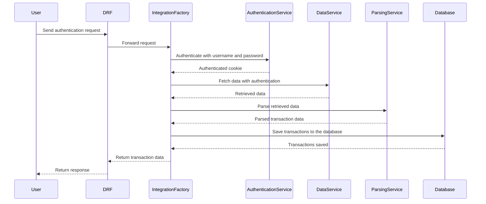

# Stocks API

## About

This service acts as an integration bridge for multiple stock brokerage services, offering a unified API layer to simplify the integration process.

## IntegratorFactory

The Integrator Factory is a versatile and extensible architectural design that streamlines the process of integration with a wide range of external stock broker sources. It not only facilitates seamless integration but also promotes isolated testing and follows a clean architectural approach.



## Running locally

```sh
# Run migrations
python manage.py migrate

# Run the test server
python manage.py runserver
```

## Tests

You can run the service tests (unit and integration) running the following commands:

```sh
# Run the test suite
python manage.py test
```

## TODO:

### Expand Integration Capabilities:
Enhance the system's versatility by adding support for more integrations, broadening its compatibility with various third-party services.

### Implement API Authentication:
Introduce a secure authentication method, such as API Keys, to ensure only authorized users can access the API.

### Idempotent Request Handling:
Make sure that the API can handle idempotent requests, providing consistent results even if the same request is made multiple times.

### Enforce Rate Limiting and Throttling Rules:
Implement rate limiting and throttling mechanisms to control the flow of requests, preventing overload and ensuring fair usage.

### Enhance Data Model and Relationships:
Improve the data model by optimizing relationships and indexing for better performance and data retrieval efficiency.

### IP Pool for Stock Broker Requests:
Create a dedicated service using a pool of trustworthy IP addresses for all requests to stock brokers. This safeguards against potential blocking by Web Application Firewalls (WAFs) like Imperva or AWS WAF.

### Data Persistence for Data Science:
The primary purpose of data persistence should focus on serving data science needs. Consider delegating this responsibility to a specialized broker, aligning with event-driven system principles for improved latency.

### Secure User Credential Management:
Explore a security approach where user credentials are stored behind a master password along with a unique salt. This ensures ease of use while maintaining robust security. Users should have the ability to update their credentials but should never be able to access them directly. Consider using a vault or Key Management Service (KMS) for this purpose.
